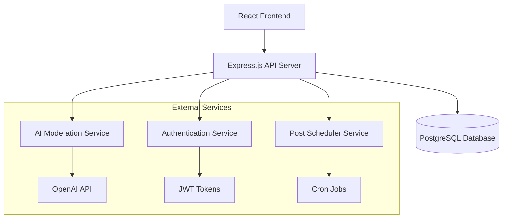

# Worrybox Design Document

## Overview

Worrybox is a compassionate social platform designed to help users externalize their worries through structured posting, optional elaboration, and supportive community interaction. The system prioritizes user safety through AI-moderated comments and flexible privacy controls, while providing scheduling capabilities for appropriate timing of posts.

The platform follows a modern web architecture with a React frontend, Node.js/Express backend, PostgreSQL database, and integrated AI services for content moderation.

## Architecture

### High-Level Architecture



### Technology Stack

**Frontend:**
- React 18 with TypeScript
- Tailwind CSS for styling
- React Router for navigation
- Axios for API communication
- React Hook Form for form handling

**Backend:**
- Node.js with Express.js
- TypeScript for type safety
- JWT for authentication
- bcrypt for password hashing
- node-cron for scheduled posts

**Database:**
- PostgreSQL 15+
- Prisma ORM for database operations
- Database migrations for schema management

**AI Services:**
- OpenAI GPT-3.5/4 for comment moderation
- Custom sentiment analysis pipeline
- Fallback to rule-based filtering

## Components and Interfaces

### Core Components

#### 1. User Management Component
- **Purpose**: Handle user registration, authentication, and profile management
- **Key Functions**:
  - User registration with email verification
  - Secure login/logout with JWT tokens
  - Password reset functionality
  - Profile management

#### 2. Worry Post Component
- **Purpose**: Create, display, and manage worry posts
- **Key Functions**:
  - Short worry creation with prompt selection
  - Optional long-form content addition
  - Privacy setting selection
  - Post scheduling interface
  - Post editing and deletion

#### 3. Feed Component
- **Purpose**: Display worry posts based on privacy settings and user relationships
- **Key Functions**:
  - Public feed for all users
  - Friends feed for followed users
  - Private feed for user's own posts
  - Infinite scroll pagination
  - Real-time updates

#### 4. Social Features Component
- **Purpose**: Handle user relationships and interactions
- **Key Functions**:
  - Follow/unfollow functionality
  - Friend relationship management
  - User discovery and search

#### 5. Comment System Component
- **Purpose**: Enable supportive commenting with AI moderation
- **Key Functions**:
  - Comment creation and display
  - AI-powered content moderation
  - Comment flagging and review
  - Nested comment threads

#### 6. AI Moderation Component
- **Purpose**: Filter and moderate user-generated content
- **Key Functions**:
  - Real-time comment analysis
  - Sentiment scoring
  - Toxicity detection
  - Manual review queue management

#### 7. AI Worry Analysis Component
- **Purpose**: Analyze and categorize worry content for similarity matching
- **Key Functions**:
  - Semantic analysis of worry content
  - Worry categorization and tagging
  - Similar worry counting and matching
  - Topic trend identification

#### 8. Subscription Management Component
- **Purpose**: Handle user subscription tiers and payment processing
- **Key Functions**:
  - Subscription tier management (Free, Paid, Advanced)
  - Payment processing integration
  - Feature access control based on tier
  - Subscription lifecycle management

#### 9. Analytics Component
- **Purpose**: Generate insights and statistics for paid users
- **Key Functions**:
  - Personal worry analytics for paid users
  - Demographic analytics for advanced users
  - Trend analysis and reporting
  - Anonymous data aggregation

#### 10. Worry Resolution Component
- **Purpose**: Track and display worry resolution progress
- **Key Functions**:
  - Mark worries as resolved
  - Capture resolution stories and coping methods
  - Display progress tracking for users
  - Show resolution success stories to community

#### 11. Guided Exercises Component
- **Purpose**: Provide therapeutic exercises and coping techniques
- **Key Functions**:
  - AI-powered exercise recommendations based on worry content
  - CBT-based coping techniques library
  - Breathing exercises and mindfulness prompts
  - Exercise effectiveness tracking

#### 12. Heat Map Visualization Component
- **Purpose**: Generate visual worry pattern analytics for advanced users
- **Key Functions**:
  - Temporal worry heat maps (time, day, season)
  - Geographic worry distribution maps
  - Category-based worry intensity visualization
  - Trend pattern identification

#### 13. Mental Health Resources Component
- **Purpose**: Connect users with professional mental health support
- **Key Functions**:
  - Crisis detection and immediate resource display
  - Local and national mental health resource directory
  - Therapy and support group recommendations
  - Emergency hotline integration

#### 14. Smart Notifications Component
- **Purpose**: Provide intelligent, supportive user engagement
- **Key Functions**:
  - AI-powered check-in notifications
  - Supportive message delivery during difficult periods
  - Community interaction notifications
  - Personalized notification frequency learning

#### 15. Internationalization Component
- **Purpose**: Provide multi-language support for global accessibility
- **Key Functions**:
  - Automatic browser language detection
  - Language preference management
  - Real-time interface language switching
  - Content language detection and storage
  - Localized AI-generated content delivery

### API Interfaces

#### Authentication Endpoints
```typescript
POST /api/auth/register
POST /api/auth/login
POST /api/auth/logout
POST /api/auth/refresh
POST /api/auth/forgot-password
POST /api/auth/reset-password
```

#### User Endpoints
```typescript
GET /api/users/profile
PUT /api/users/profile
GET /api/users/search
POST /api/users/follow/:userId
DELETE /api/users/follow/:userId
GET /api/users/followers
GET /api/users/following
```

#### Post Endpoints
```typescript
POST /api/posts
GET /api/posts/feed
GET /api/posts/user/:userId
GET /api/posts/:postId
PUT /api/posts/:postId
DELETE /api/posts/:postId
PUT /api/posts/:postId/privacy
POST /api/posts/schedule
GET /api/posts/scheduled
```

#### Comment Endpoints
```typescript
POST /api/posts/:postId/comments
GET /api/posts/:postId/comments
PUT /api/comments/:commentId
DELETE /api/comments/:commentId
POST /api/comments/:commentId/flag
```

#### Subscription Endpoints
```typescript
GET /api/subscriptions/plans
POST /api/subscriptions/subscribe
PUT /api/subscriptions/change-plan
DELETE /api/subscriptions/cancel
GET /api/subscriptions/status
POST /api/subscriptions/webhook
```

#### Analytics Endpoints
```typescript
GET /api/analytics/personal (Paid tier)
GET /api/analytics/demographics (Advanced tier)
GET /api/analytics/trends (Advanced tier)
GET /api/analytics/worry-categories (Advanced tier)
```

#### AI Analysis Endpoints
```typescript
POST /api/ai/analyze-worry
GET /api/ai/similar-worries/:postId
POST /api/ai/categorize-content
```

#### Worry Resolution Endpoints
```typescript
PUT /api/posts/:postId/resolve
POST /api/posts/:postId/resolution-story
GET /api/posts/resolved
GET /api/analytics/resolution-progress (Paid tier)
```

#### Guided Exercises Endpoints
```typescript
GET /api/exercises/recommendations/:postId
GET /api/exercises/library
POST /api/exercises/complete
GET /api/exercises/user-progress
```

#### Mental Health Resources Endpoints
```typescript
GET /api/resources/crisis
GET /api/resources/therapy
GET /api/resources/local/:location
POST /api/resources/crisis-detected
```

#### Notifications Endpoints
```typescript
GET /api/notifications
PUT /api/notifications/preferences
POST /api/notifications/check-in
GET /api/notifications/history
```

#### Internationalization Endpoints
```typescript
GET /api/i18n/languages
PUT /api/users/language-preference
GET /api/i18n/translations/:language
POST /api/posts/detect-language
```

## Data Models

### User Model
```sql
CREATE TABLE users (
    id UUID PRIMARY KEY DEFAULT gen_random_uuid(),
    email VARCHAR(255) UNIQUE NOT NULL,
    password_hash VARCHAR(255) NOT NULL,
    username VARCHAR(50) UNIQUE NOT NULL,
    display_name VARCHAR(100),
    bio TEXT,
    avatar_url VARCHAR(500),
    email_verified BOOLEAN DEFAULT FALSE,
    created_at TIMESTAMP DEFAULT CURRENT_TIMESTAMP,
    updated_at TIMESTAMP DEFAULT CURRENT_TIMESTAMP
);
```

### Post Model
```sql
CREATE TABLE posts (
    id UUID PRIMARY KEY DEFAULT gen_random_uuid(),
    user_id UUID REFERENCES users(id) ON DELETE CASCADE,
    short_content TEXT NOT NULL,
    long_content TEXT,
    worry_prompt VARCHAR(100) NOT NULL,
    privacy_level VARCHAR(20) NOT NULL CHECK (privacy_level IN ('public', 'friends', 'private')),
    is_scheduled BOOLEAN DEFAULT FALSE,
    scheduled_for TIMESTAMP,
    published_at TIMESTAMP,
    created_at TIMESTAMP DEFAULT CURRENT_TIMESTAMP,
    updated_at TIMESTAMP DEFAULT CURRENT_TIMESTAMP
);
```

### Comment Model
```sql
CREATE TABLE comments (
    id UUID PRIMARY KEY DEFAULT gen_random_uuid(),
    post_id UUID REFERENCES posts(id) ON DELETE CASCADE,
    user_id UUID REFERENCES users(id) ON DELETE CASCADE,
    content TEXT NOT NULL,
    moderation_status VARCHAR(20) DEFAULT 'pending' CHECK (moderation_status IN ('approved', 'flagged', 'rejected', 'pending')),
    moderation_score DECIMAL(3,2),
    parent_comment_id UUID REFERENCES comments(id),
    created_at TIMESTAMP DEFAULT CURRENT_TIMESTAMP,
    updated_at TIMESTAMP DEFAULT CURRENT_TIMESTAMP
);
```

### Follow Relationship Model
```sql
CREATE TABLE follows (
    id UUID PRIMARY KEY DEFAULT gen_random_uuid(),
    follower_id UUID REFERENCES users(id) ON DELETE CASCADE,
    following_id UUID REFERENCES users(id) ON DELETE CASCADE,
    created_at TIMESTAMP DEFAULT CURRENT_TIMESTAMP,
    UNIQUE(follower_id, following_id)
);
```

### Subscription Model
```sql
CREATE TABLE subscriptions (
    id UUID PRIMARY KEY DEFAULT gen_random_uuid(),
    user_id UUID REFERENCES users(id) ON DELETE CASCADE,
    tier VARCHAR(20) NOT NULL CHECK (tier IN ('free', 'paid', 'advanced')),
    status VARCHAR(20) NOT NULL CHECK (status IN ('active', 'cancelled', 'expired')),
    stripe_subscription_id VARCHAR(255),
    current_period_start TIMESTAMP,
    current_period_end TIMESTAMP,
    created_at TIMESTAMP DEFAULT CURRENT_TIMESTAMP,
    updated_at TIMESTAMP DEFAULT CURRENT_TIMESTAMP
);
```

### Worry Analysis Model
```sql
CREATE TABLE worry_analysis (
    id UUID PRIMARY KEY DEFAULT gen_random_uuid(),
    post_id UUID REFERENCES posts(id) ON DELETE CASCADE,
    category VARCHAR(100) NOT NULL,
    subcategory VARCHAR(100),
    sentiment_score DECIMAL(3,2),
    keywords TEXT[],
    similar_worry_count INTEGER DEFAULT 0,
    analysis_version VARCHAR(10) DEFAULT '1.0',
    created_at TIMESTAMP DEFAULT CURRENT_TIMESTAMP,
    updated_at TIMESTAMP DEFAULT CURRENT_TIMESTAMP
);
```

### Analytics Cache Model
```sql
CREATE TABLE analytics_cache (
    id UUID PRIMARY KEY DEFAULT gen_random_uuid(),
    cache_key VARCHAR(255) UNIQUE NOT NULL,
    data JSONB NOT NULL,
    expires_at TIMESTAMP NOT NULL,
    created_at TIMESTAMP DEFAULT CURRENT_TIMESTAMP
);
```

### Worry Resolution Model
```sql
CREATE TABLE worry_resolutions (
    id UUID PRIMARY KEY DEFAULT gen_random_uuid(),
    post_id UUID REFERENCES posts(id) ON DELETE CASCADE,
    user_id UUID REFERENCES users(id) ON DELETE CASCADE,
    resolution_story TEXT,
    coping_methods TEXT[],
    helpfulness_rating INTEGER CHECK (helpfulness_rating BETWEEN 1 AND 5),
    resolved_at TIMESTAMP DEFAULT CURRENT_TIMESTAMP,
    created_at TIMESTAMP DEFAULT CURRENT_TIMESTAMP
);
```

### Guided Exercises Model
```sql
CREATE TABLE guided_exercises (
    id UUID PRIMARY KEY DEFAULT gen_random_uuid(),
    title VARCHAR(200) NOT NULL,
    description TEXT NOT NULL,
    category VARCHAR(100) NOT NULL,
    instructions JSONB NOT NULL,
    duration_minutes INTEGER,
    difficulty_level VARCHAR(20) CHECK (difficulty_level IN ('beginner', 'intermediate', 'advanced')),
    created_at TIMESTAMP DEFAULT CURRENT_TIMESTAMP
);

CREATE TABLE user_exercise_completions (
    id UUID PRIMARY KEY DEFAULT gen_random_uuid(),
    user_id UUID REFERENCES users(id) ON DELETE CASCADE,
    exercise_id UUID REFERENCES guided_exercises(id) ON DELETE CASCADE,
    post_id UUID REFERENCES posts(id) ON DELETE CASCADE,
    effectiveness_rating INTEGER CHECK (effectiveness_rating BETWEEN 1 AND 5),
    notes TEXT,
    completed_at TIMESTAMP DEFAULT CURRENT_TIMESTAMP
);
```

### Mental Health Resources Model
```sql
CREATE TABLE mental_health_resources (
    id UUID PRIMARY KEY DEFAULT gen_random_uuid(),
    name VARCHAR(200) NOT NULL,
    type VARCHAR(50) NOT NULL CHECK (type IN ('crisis_hotline', 'therapy', 'support_group', 'online_resource')),
    description TEXT,
    phone_number VARCHAR(20),
    website_url VARCHAR(500),
    location VARCHAR(200),
    country_code VARCHAR(3),
    is_crisis_resource BOOLEAN DEFAULT FALSE,
    is_active BOOLEAN DEFAULT TRUE,
    created_at TIMESTAMP DEFAULT CURRENT_TIMESTAMP
);
```

### Smart Notifications Model
```sql
CREATE TABLE user_notifications (
    id UUID PRIMARY KEY DEFAULT gen_random_uuid(),
    user_id UUID REFERENCES users(id) ON DELETE CASCADE,
    type VARCHAR(50) NOT NULL,
    title VARCHAR(200) NOT NULL,
    message TEXT NOT NULL,
    is_read BOOLEAN DEFAULT FALSE,
    scheduled_for TIMESTAMP,
    sent_at TIMESTAMP,
    created_at TIMESTAMP DEFAULT CURRENT_TIMESTAMP
);

CREATE TABLE notification_preferences (
    id UUID PRIMARY KEY DEFAULT gen_random_uuid(),
    user_id UUID REFERENCES users(id) ON DELETE CASCADE,
    check_in_frequency VARCHAR(20) DEFAULT 'weekly' CHECK (check_in_frequency IN ('daily', 'weekly', 'monthly', 'never')),
    supportive_messages BOOLEAN DEFAULT TRUE,
    community_interactions BOOLEAN DEFAULT TRUE,
    quiet_hours_start TIME DEFAULT '22:00',
    quiet_hours_end TIME DEFAULT '08:00',
    created_at TIMESTAMP DEFAULT CURRENT_TIMESTAMP,
    updated_at TIMESTAMP DEFAULT CURRENT_TIMESTAMP
);
```

### Internationalization Model
```sql
CREATE TABLE supported_languages (
    id UUID PRIMARY KEY DEFAULT gen_random_uuid(),
    code VARCHAR(10) UNIQUE NOT NULL,
    name VARCHAR(100) NOT NULL,
    native_name VARCHAR(100) NOT NULL,
    is_active BOOLEAN DEFAULT TRUE,
    created_at TIMESTAMP DEFAULT CURRENT_TIMESTAMP
);

CREATE TABLE user_language_preferences (
    id UUID PRIMARY KEY DEFAULT gen_random_uuid(),
    user_id UUID REFERENCES users(id) ON DELETE CASCADE,
    language_code VARCHAR(10) REFERENCES supported_languages(code),
    created_at TIMESTAMP DEFAULT CURRENT_TIMESTAMP,
    updated_at TIMESTAMP DEFAULT CURRENT_TIMESTAMP
);

-- Add language detection to posts
ALTER TABLE posts ADD COLUMN detected_language VARCHAR(10);
ALTER TABLE comments ADD COLUMN detected_language VARCHAR(10);
```

## Error Handling

### API Error Response Format
```typescript
interface ErrorResponse {
    error: {
        code: string;
        message: string;
        details?: any;
    };
    timestamp: string;
    path: string;
}
```

### Error Categories
1. **Authentication Errors** (401): Invalid credentials, expired tokens
2. **Authorization Errors** (403): Insufficient permissions
3. **Validation Errors** (400): Invalid input data
4. **Not Found Errors** (404): Resource doesn't exist
5. **Rate Limiting Errors** (429): Too many requests
6. **Server Errors** (500): Internal system failures

### AI Moderation Error Handling
- **Fallback Strategy**: If AI service fails, use rule-based filtering
- **Timeout Handling**: 5-second timeout with automatic approval for borderline content
- **Rate Limiting**: Implement queuing for high-volume comment periods
- **Manual Review**: Flag uncertain cases for human moderation

## Testing Strategy

### Unit Testing
- **Backend**: Jest with Supertest for API endpoints
- **Frontend**: Jest with React Testing Library
- **Database**: Test database with seed data
- **AI Moderation**: Mock AI responses for consistent testing

### Integration Testing
- **API Integration**: Full request/response cycle testing
- **Database Integration**: Real database operations with test data
- **Authentication Flow**: Complete login/logout cycles
- **Comment Moderation**: End-to-end AI moderation pipeline

### End-to-End Testing
- **User Journeys**: Complete user workflows from registration to posting
- **Privacy Controls**: Verify post visibility across different privacy levels
- **Scheduling**: Test scheduled post publication
- **Comment Moderation**: Verify AI filtering and manual review processes

### Performance Testing
- **Load Testing**: Simulate concurrent users and high post volumes
- **Database Performance**: Query optimization and indexing validation
- **AI Service Performance**: Response time and accuracy metrics
- **Caching Strategy**: Redis caching for frequently accessed data

### Security Testing
- **Authentication Security**: JWT token validation and expiration
- **Input Validation**: SQL injection and XSS prevention
- **Privacy Controls**: Ensure posts are only visible to authorized users
- **Rate Limiting**: Prevent abuse and spam